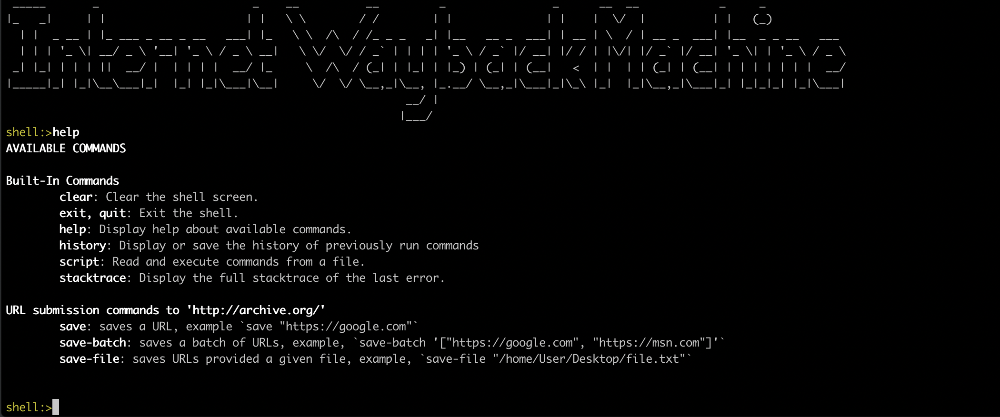

# Internet Wayback Machine [](https://travis-ci.org/kasramp/InternetWayBackMachine)
 
This small utility enables you to submit as many URLs as you like to [https://archive.org](https://archive.org).



## How to use

Download a Jar file from [release section](https://github.com/kasramp/InternetWayBackMachine/releases).

Then run:

```bash
$ java -jar [jar file name].jar
``` 

After that you should be able to interact with the app.

To get started type `help`.

At the moment only **three commands** are supported which are:

- `save`: saves a URL. Examples: 
    
    - `save "https://google.com"`
    - `save https://google.com` 
    
- `save-batch`: saves a batch of URLs. Example,
    - `save-batch '["https://google.com", "https://yahoo.com"]`
    
- `save-file`: submits all URLs of the file. For sample file see [sample_file.txt](./assets/sample_file.txt). Example,
    - `save-file /file/path Or file\\path`
    

## Important note

This is a revamped version (rewritten) of the classic Internet Wayback Machine. 
PHP supported is dropped. However, if you still want to access to the old code
you can access to [classic-old](https://github.com/kasramp/InternetWayBackMachine/tree/classic-old) branch. That code is not maintained anymore though. 


## Development

Clone the repository and to run the project:

```bash
$ mvn spring-boot:run
```

## License

Internet Wayback Machine is [MIT licensed](./LICENSE).


## Contact

* kasra@madadipouya.com